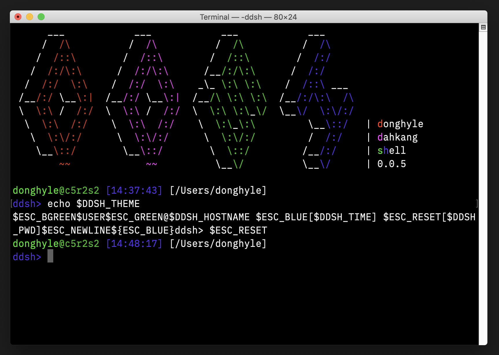
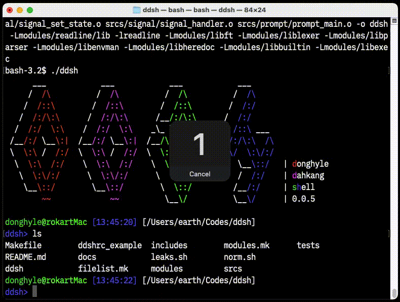
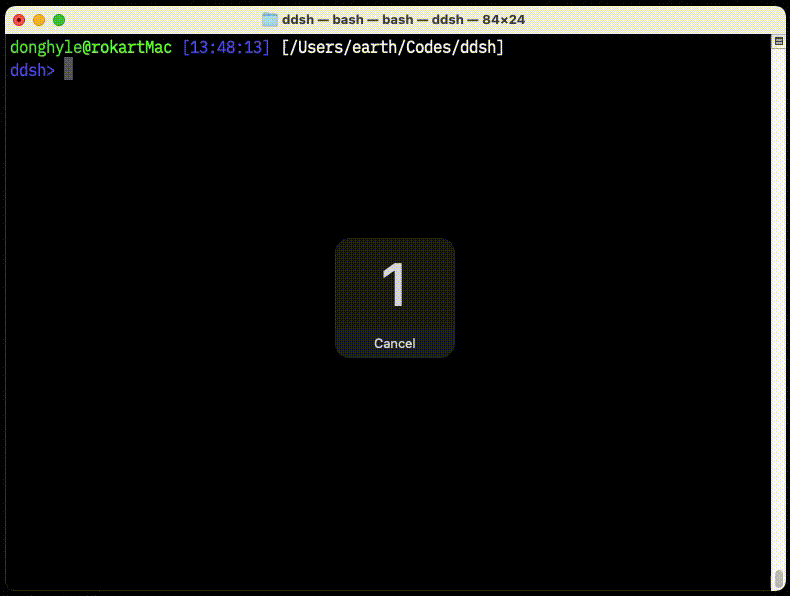
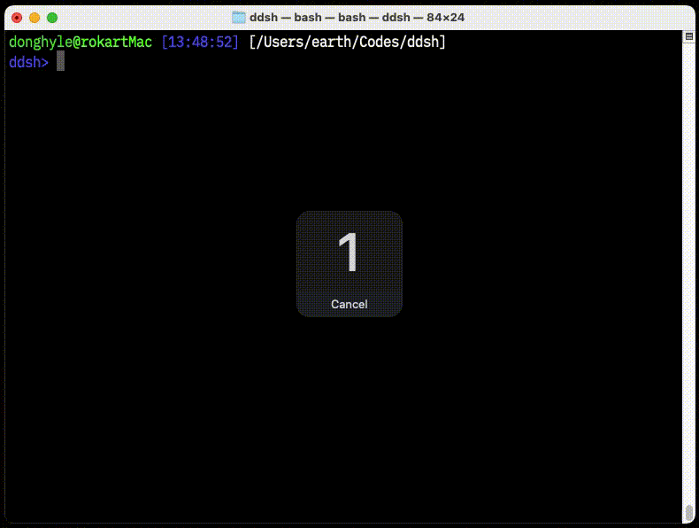

# ddsh

*우리가만든셸우리가쓰자!*

# 개요

42cursus의 minishell 과제를 수행하며 탄생한 셸을 일상 생활에서 사용할 수 있는 수준까지 발전시킨 프로젝트입니다. 42 norm을 준수하여 작성되었으나 몇몇 금지된 외부 함수를 사용합니다. (`time()` 등)

> bash는 `[배ː시]`, ddsh는 `[뚜ː시]`입니다.

### 빌드

macOS Catalina를 완전 지원하며 제한적으로 Debian Linux를 지원합니다.

# 기능

#### pipe 생성 및 프로세스 연결

#### here-document

#### cd시 PWD 및 OLDPWD 설정

### 지원하는 기능

- 프롬프트의 히스토리, 자동 완성을 지원합니다.
- bash와 같은 방식으로 `'` 및 `"`을 사용한 quoting을 지원합니다.
- 표준 입/출력의 리디렉션을 지원합니다.
  - `<` `>` `<<` `>>`를 통해 입/출력 파일 또는 here-document를 지정할 수 있습니다.
- `|`를 통해 여러 프로세스를 파이프로 연결해 실행할 수 있습니다.
- 환경 변수 확장 및 `$?`를 지원합니다.
- 다음 빌트인 명령을 지원합니다.
  - `echo [-n]`
  - `cd`
  - `pwd`
  - `export`
  - `unset`
  - `env`
  - `exit`

### 지원하지 않는 기능

- 여러 줄에 걸친 입력
  - `do ... while` 등의 모든 제어 예약어
  - 닫히지 않은 따옴표 처리
- 대부분의 빌트인 함수

# 참고 문서

- [Bash 사용지침서](docs/Bash%20Reference%20Manual.md)
- [디렉토리 구조](docs/Directory%20Structure.md)
- [허용 외부 함수](docs/External%20Functions.md)
- [버젼 로드맵](docs/Roadmap.md)
- [특수 변수](docs/Special%20Variables.md)
