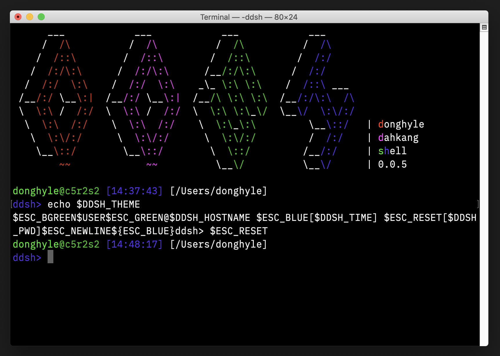

# ddsh

> 자쓰가리우셸든만가리우

# 개요

42cursus의 minishell 과제로 인해 개발된 셸이 아까워 일상 생활에서 사용할 수 있는 수준까지 기능을 추가한 셸

42 norm을 준수하여 작성되었으나 몇몇 금지된 외부 함수를 사용함

# 기능

Bash와 유사하지만 대부분의 기능이 생략됨

- 여러 줄에 걸친 입력
  - `do ... while` 등의 모든 제어 예약어
  - 닫히지 않은 따옴표 처리
- 대부분의 빌트인 함수

# 참고 문서

[Bash 사용지침서](docs/Bash%20Reference%20Manual.md)
[디렉토리 구조](docs/Directory%20Structure.md)
[허용 외부 함수](docs/External%20Functions.md)
[버젼 로드맵](docs/Roadmap.md)
[특수 변수](docs/Special%20Variables.md)
